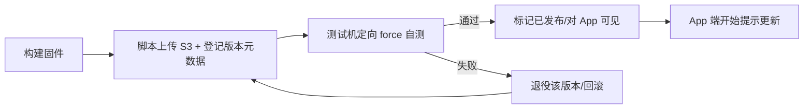
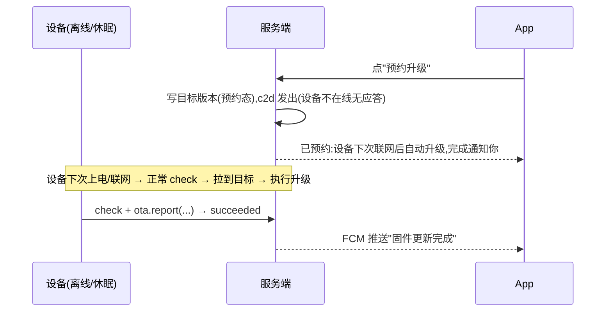

# 固件 OTA 版本管理 + 在线更新 — 产品需求文档(固件 + 服务端 + App)

## 1. 文档信息

| 版本号 | 创建日期 | 负责人 | 状态 |
|--------|----------|--------|------|
| V1.0 | 2026-09-07 | [待定] | 待评审 |

## 2. 修订历史

| 版本 | 修订内容 | 修订时间 | 修订人 |
|------|----------|----------|--------|
| V1.0 | 初稿创建(版本管理 / App 触发在线更新 / 自检回滚 / 安全基线) | 2026-09-07 | [待定] |

## 3. 名词解释

| 术语 | 解释 |
|------|------|
| OTA | Over-The-Air:固件通过无线网络从云端下载并替换自身程序,无需 USB 连线烧录 |
| 固件 | 设备端 ESP32-S3 上运行的应用程序(app 分区镜像,约 3.1MB) |
| 双分区 / A-B | `ota_0`/`ota_1` 两个等大 app 分区:一个在跑,新固件写入另一个;验证通过后切换启动,保证可回滚 |
| 版本号 | 固件发布版本,语义化版本(如 2.3.0),随构建写入固件;服务端与设备按此比较新旧 |
| 发布态 | 版本目录里每个版本的生命周期状态:已上传(draft)/已发布(released)/已退役(retired),代码与迁移用括号英文。仅"已发布"参与"最新可用"计算;退役只影响之后的新升级,不打断在途任务 |
| force 强制 | 服务端对目标设备标记"无视版本高低一律安装该版本",用于同版重装/回滚/救砖 |
| 自检回滚 | 新固件启动后需在窗口内自检通过(联网 + 上报成功)并"确认有效";否则下次重启自动回退到上一个好版本 |
| 目标版本 | 用户/脚本给某台设备设定的"期望固件版本";设备按其决定是否下载 |
| 检查(check) | 设备联网后向服务端查询"我该不该升级"的请求;也顺带获取 WS/MQTT 配置与服务器时间 |
| c2d | 云端到设备(control-to-device)的 MQTT 通道,设备待机时保持在线;用于"催一次检查" |
| presigned URL | S3 对象存储签发的短时(30 分钟)有效 HTTPS 下载链接,设备凭此直接拉取固件包 |
| 签名 | 对固件包内容指纹做 ECDSA 签名;设备内置公钥验签后才写入,防止包被替换/篡改 |
| App 触发 | 主用户在自己的手机上点"立即升级",服务端为该设备设定目标版本 |
| 预约升级 | 设备离线时用户仍可点升级:服务端写目标版本并置"预约",设备下次联网/上电后自动补升级,完成后推送 |
| FCM 系统推送 | Firebase Cloud Messaging 推送;App 已接入,用于 OTA 完成/失败回执(即使 App 被杀也能收到) |
| 总超时 | 服务端判定一次升级"卡死"的时限(默认 5 分钟无终态即失败态),App 不自摆超时 |
| OTA 使能版 | 首个开启 OTA 检查能力的固件版本;存量设备需 USB 线下刷一次才能进入 OTA 闭环 |

## 4. 产品概述

### 4.1 产品背景

#### 市场现状

消费电子固件升级在业界是标配能力,形态分三层:云后台批量推送(HomePod / Alexa / 小米音箱,用户无感);**用户 App 触发**(米家 / 涂鸦 / SwitchBot 等"固件更新"页,用户点升级并可见进度与结果);纯自动。对"用户拥有、重视隐私与变化感知"的陪伴型硬件,App 触发 + 状态可见是主流且体验最好。设备侧标准做法为 A-B 双分区 + 新固件自检确认、失败自动回滚;生产链路普遍做镜像签名与 HTTPS,防包被替换/篡改。

#### 问题与机会

Pigugu 固件目前**没有任何在线升级能力**:
- 每次更新固件都要拿 USB 线 + 电脑 + esptool 手动烧录(5 分区布局),用户无法自助、远程/家人设备根本无法更新;
- 服务端不知道任何一台设备跑着什么固件版本(git/语义版均不落库),出问题无法按版本归因;
- 修复 bug、发新功能只能线下刷机,无法灰度、无法回滚。

机会:复用固件里已存在但被关闭的 xiaozhi OTA 客户端 + 服务端已有的 `/v1/device/ota` 配置下发桩 + 设备已在线的 AWS IoT MQTT 控制面 + App 设备绑定,以**最小改动**补齐"版本管理 → App 触发 → 设备自助升级 → 状态回传 → 自检回滚"完整闭环。

#### 为什么是现在

- 固件侧 A-B 分区、`esp_ota` 流式下载、应用自检回滚(`MarkCurrentVersionValid`)等机制已随 xiaozhi 代码就位,只差"打开开关 + 上报 + 触发",边际成本低;
- 语音链路与 idle 设计刚定型,设备在待机(非会话)态可安全执行升级;
- 设备已全部连 AWS IoT MQTT(c2d 通道现成),App 点升级后能**秒级催检查**,不必依赖慢轮询;
- 硬件播放卡顿等回归问题刚暴露,"固件按版本可追踪、可快速回滚"是诊断与自救的前提。

#### 我们的优势

- 全栈可控:固件/服务端/App 同一团队,通道、触发、状态、安全两端对称设计;
- 现成积木多:OTA 客户端、ota 配置桩、MQTT 控制面、S3+IRSA 先例、App 绑定,几乎不引新依赖。

### 4.2 产品目标

| 目标 | 度量口径 |
|------|----------|
| 任何固件更新不再需要 USB 线 | 发布后,线上设备可 100% 通过 OTA 完成升级(首次 OTA 使能版除外) |
| 服务端掌握每台设备固件版本 | `devices` 表 `current_firmware_version` 随设备每次联网/上报更新,非空率 ≥99%(已 OTA 使能设备) |
| 用户在 App 自助升级自己的设备 | 绑定设备有新版时 App 可见;用户点"立即升级"→ 目标设备成功率 ≥95%(排除离线/断电) |
| 升级失败自动恢复 | 新固件自检失败/崩溃 → 自动回滚旧版;回滚率、失败原因可查 |
| 可灰度、可回滚 | 内部脚本可对指定设备定向发布/force 重装;版本可退役 |

### 4.3 目标用户

| 用户 | 画像 | 关心的 OTA 能力 |
|------|------|----------------|
| 主用户(拥有设备的人) | 通过 pigugu-app 绑定设备;可能不会/不愿碰电脑 | App 看到"有新版本",一键升级,进度与结果可见;失败不折腾 |
| 开发者 / 运营(我们) | 改固件、发版本、排查问题 | 上传发布、对测试机定向 force、版本列表与每设备当前版本、失败/回滚看板 |
| 非目标 | 大规模 OEM 渠道 / 需要后台批量灰度的运营商 | 本版不做后台批量灰度 UI(AWS Jobs / admin 灰度列 Phase2+) |

### 4.4 用户痛点

1. **更新一次固件=一次刷机手术**。要装 esptool、找对串口、拔插、烧 5 个分区,普通用户做不到;设备送人/放家人处后彻底失去更新能力。
2. **版本不可知**。出了 bug 不知道哪些设备中招、各自跑什么版本;修好也只能"逐个手动刷"。
3. **改坏了很难回来**。没有线上回滚,刷死只能再插线。

### 4.5 主要功能(五件套)

| # | 功能 | 一句话 |
|---|------|--------|
| F1 | 固件版本管理 | 内部脚本上传发布包(版本/sha/签名/说明),版本列表、退役;服务端存每设备当前版本 |
| F2 | 升级发现 | 设备上报当前版本;App 展示"可用更新 Vx" |
| F3 | App 触发升级 | 用户点升级 → 服务端设目标版本 → 设备(秒级)c2d 催检 → 下载→安装→重启 |
| F4 | 自检回滚 + 重试 | 新固件自检失败自动回旧版;失败原因落库,App 可重试 |
| F5 | 定向发布/强制 | 内部对指定测试机发布/force(同版重装、回滚到旧版),支撑自测与救砖 |
| F6 | 升级交互与回执 | App 升级页动画/文案(如实承诺:即使退出也会继续、完成后通知)、离线预约、完成/失败 FCM 推送 + 站内、离场恢复(§5.4) |

### 4.6 竞品分析

| 维度 | 米家 / 涂鸦(用户 App 触发) | HomePod / Alexa(后台静默) | xiaozhi 社区默认(HTTP 轮询) | 我们(本版) |
|------|---------------------------|---------------------------|------------------------------|------------|
| 触发 | App 点升级 | 云端自动 | 设备启动轮询 | App 触发为主 |
| 可见性 | App 状态页 | 基本无感 | 无(设备屏显) | App 状态回传 |
| 回滚 | 设备自检回滚 | 设备自检回滚 | 自检回滚(已实现但未启用) | 自检回滚 + force 人工回滚 |
| 下载 | 对象存储/CDN | CDN | 任意 HTTP(S) URL | S3 presigned(30min) |
| 签名 | 多数有 | 有 | 默认无 | HTTPS + ECDSA 验签 |

**启示**:业界共识 = 设备端 A-B + 自检回滚(我们有)、对象存储/ CDN 承载下载(我们选 S3)、HTTPS + 签名防篡改(本版做 app 级签名)。触发/可见性按自家产品形态选 App 触发,用户体验对标米家而非无感推送。

## 5. 功能需求

### 5.1 固件版本管理与发布(F1,F5 · 内部)

#### 功能概述

开发者/运营把一次固件构建"发布进系统":上传 app 镜像到 S3,登记版本元数据(版本号、git sha、板型、sha256、签名、说明、是否对 App 可见/退役)。版本生命周期:已上传 → 已发布(对 App 可见)→ 已退役。

#### 用户场景

- 修完一个 bug,构建 2.3.1,上传发布,先对 2 台测试机定向 force 自测,确认后再"发布可见",用户 App 开始提示。
- 2.3.1 出问题 → 脚本对受影响设备定向 force 回 2.3.0;必要时把 2.3.1 退役(新设备/新升级不再指向它)。

#### 功能流程(发布与定向发布)



#### 前置/后置条件

- 前置:构建产物为 app 分区镜像(app 镜像,非烧录合并包);上传者具备发布密钥(签名私钥仅在构建机/CI)。
- 后置:版本进入列表;服务端可签发其下载链接。

#### 异常场景

- 版本号比已上线设备版本低 / 重复 → 脚本拦截(需 force 才允许)。
- 上传中断 → 该版本**不会登记入版本目录**(先传 S3、传完整后脚本才登记),不存在"半截"对外可见的版本。

---

### 5.2 升级发现 + App 触发升级(F2,F3 · 主链路)

#### 功能概述

设备每次联网/定期把"当前固件版本"报给服务端;服务端比较已发布的最新版本,给 App 返回"可用更新"。用户在 App 点"立即升级" → 服务端为**该台**设备写入目标版本 → 通过 c2d 催该设备立即检查 → 设备在空闲态下载(S3 presigned,HTTPS)→ 写入另一分区 → 重启 → 自检 → 确认有效 → 上报新版本。全程状态回传 App。

#### 用户场景

一天晚上用户打开 App,设备卡片上出现"固件更新可用 V2.3.1",点"立即升级":App 进入升级页(动画 + 进度),设备响一声提示音、屏幕显示进度;期间用户切到别的 App 甚至关掉 App 都不影响——更新在设备端继续,完成后手机收到系统推送"固件更新完成",重开 App 看到"已是最新"。若用户点的时候设备正好休眠/断电,App 显示"设备当前离线,可预约升级",用户确认后,设备下次联网会自动补升级并在完成后推送。全程无需电脑。

#### 功能流程(在线点升级)

```mermaid
sequenceDiagram
    participant D as 设备(ESP32-S3)
    participant S as 服务端
    participant A as App
    A->>S: 拉取设备列表+固件信息
    S-->>A: 当前版本 / 可用更新 V2.3.1
    A->>S: 点"立即升级"(device_id)
    S->>S: 建 active 任务(requested)
    S->>D: c2d {msg_type:ota.check}(设备在线时)
    D->>S: 检查(check):带当前版本
    S-->>D: firmware{version,url,sha256,signature,force} + server_time
    D->>S3: HTTPS 下载(验 sha+签名)→写入另一分区→重启
    D->>S: ota.report(downloading/…%/rebooting)
    D->>S: 自检通过 → ota.report(succeeded) + MarkCurrentVersionValid
    S->>S: job→succeeded;更新 devices.current_firmware_version
    S-->>A: (站内)状态=已是最新
    S-->>A: FCM 推送"固件更新完成"(即使 App 已被杀)
```

#### 功能流程(设备离线 → 预约)



#### 触发节奏(检查时机)

- 设备上电联网后执行一次检查(与既有配置下发同一次请求)。
- 收到 c2d `ota.check` 时立即检查(用户刚点了升级)。
- 待机(idle)期按可配周期兜底检查(默认如 6h;设备量小、用户随时会点 App,此兜底用于离线错过 c2d 的情形)。
- **设备在线收到催检 → 秒级启动;设备离线 → 下次上电/联网检查时生效。**
- 前提说明:c2d 秒级催检依赖"设备待机(idle)期仍保持 WiFi/MQTT 在线",此保活尚待真机确认;若待机断连,催检不可达,即退化为上电检查 + idle 周期兜底(见技术方案 §2.4/§5)。

#### 升级执行时机(不打断体验)

- 仅在设备**空闲态**(无语音会话、无 TTS 播放)执行。
- 若设备正在会话中收到目标/催检 → 挂起,**当前轮结束后再执行**;用户对话不被升级打断。
- 升级开始前播放一声提示音、屏幕显示"升级中 xx%"。

#### 前置/后置条件

- 前置:设备已绑定到该用户;目标版本已发布;设备空闲;网络可达(下载源 S3)。
- 后置:设备要么跑新版本并自检通过(App 显示已最新),要么回滚到旧版并可见失败原因。

#### 异常场景

- **下载中断(断网/断电,未写完)**:继续跑旧版,状态"失败(可重试)";下次检查/用户重试再下载。
- **下载完成、重启后自检失败或崩溃**:启动引导在确认窗口内自动回滚旧版;服务端记录 rolled_back 与原因。
- **presigned URL 过期(30min)**:设备重试时重新 check 拿新 URL,不依赖旧链接。
- **用户在升级中再次点升级**:忽略(已有唯一 active 任务),App 提示"正在升级"。
- **设备离线超过 N 天**:App 显示"离线,未升级";上线后自动补上目标。

---

### 5.3 状态与失败可见(F3 附属)

#### 状态模型

| 状态 | App 展示 |
|------|----------|
| 无目标 | 已是最新 / 无可用更新 |
| 有可用更新(未点) | 可用更新 Vx(可点升级) |
| 预约(设备离线) | 已预约:设备下次联网后自动升级 |
| 下载中 / 安装中 / 重启中 | 升级中…(动画,见 §5.4) |
| 成功(已确认) | 已是最新(可看更新说明)+ FCM 推送 |
| 失败(可重试) | 升级失败 + 原因 + 重试按钮 + FCM 推送 |
| 回滚(旧版) | 升级失败(已回滚)+ 原因 + FCM 推送 |

> 进度取"粗粒度状态"(10% 档 + 关键节点)而非实时字节,避免设备端高频上报消耗 MQTT/电池。**App 不自摆超时**:卡住与否由服务端"总超时"(默认 5 分钟无终态)判定,App 只渲染服务端状态。

#### 可观测性(内部看板)

- 服务端记录每次升级任务的完整状态机与时间戳(请求/催检/下载/安装/重启/确认/失败/回滚);
- 每台设备当前固件版本(git + 语义版)随时可查,支持按版本统计在线分布 → 排查"哪些设备还在旧版、哪些受影响"。

---

### 5.4 App 升级交互与回执(前台体验层)

> 原则:**升级动画是"前台体验层",真实状态在服务端,设备端执行**;完成/失败由系统推送闭环。App 进程是否存活不影响升级结果(已对齐:后台可靠 + 推送回执;离线允许预约;回执 = 系统推送 + 站内)。

#### 入口与页面

- 设备卡片:常驻一行固件摘要(当前版本);有可用更新时显示横幅(新版本号 + 更新说明 + `[立即升级]` / `[稍后]`)。横幅为**常驻提示**(每次进入设备 tab 都出现),直到升级成功或该版本退役;`[稍后]` 仅收起本次查看,不代表永久忽略。
- 设备离线:升级按钮降级为"预约"形态,文案"设备当前离线,可在联网后自动升级"。
- 点"立即升级/预约":进入升级页(全屏/半屏)。

#### 升级页动画与文案(五段)

| 段 | 展示 | 文案要点 |
|----|------|----------|
| ① 连接设备 | 转圈(不定进度) | "正在连接设备…" |
| ② 下载 | 进度条 + %(每 10% 一档) | "正在下载更新包…" |
| ③ 安装/重启 | 不定进度 + 强调卡 | "设备会重启一次,期间会短暂断网,属正常;请保持设备通电" |
| ④ 自检 | 转圈 | "设备正在自检,马上就好…" |
| ⑤ 完成 | ✓ + 新版本 | "更新完成,已是最新 V2.3.1"(可看更新说明) |

- ①②段顶部常驻引导:**"请保持网络通畅;即使退出本页,更新也会继续完成,结束后会通知你。"**(把"别断网别关 App"从吓唬改成如实承诺)
- ③④重启盲窗:设备会断 MQTT/网络数十秒,**App 以"重启中"不定进度容纳**,不收"进度更新"不判失败;只有收到显式终态(succeeded / failed / rolled_back)才离开升级页。
- 卡住判定交给服务端:总超时(默认 5 分钟无终态)→ 服务端置失败 → App 呈现失败态,不自摆计时器。

#### 离场 / 恢复 / 重试

- 用户切后台 / 杀进程 / 关 App:升级继续;完成或失败推 FCM(冷启动可达);再次打开 App → 向服务端拉真实 job 状态,**续上对应界面**(不会停在假的"升级中")。
- 失败态:展示服务端原因 + `[重试]`(重试=重新触发一次新任务);已回滚态展示"已回到 Vx"。
- 通知权限:首次触发升级前引导授权系统通知(否则"完成推送"收不到,站内仍可见)。

### 5.5 安全与非功能需求

#### 安全(用户已拍板:HTTPS + app 级签名)

- 下载仅 HTTPS(S3 presigned),设备 crt-bundle 校验服务端证书;
- **镜像完整性 + 真实性**:构建时对固件指纹做 ECDSA-P256 签名;设备下载后先验 sha256,再用内置公钥验签名,通过才写入。防下载源泄露/对象被替换;
- 签名私钥仅存构建机/CI(不进代码仓库);
- 本版**不烧 eFuse**(Secure Boot / anti-rollback 为一次性不可逆决策,留待量产定型);
- 升级动作必须来自绑定的 App(走现有用户鉴权 + 设备归属校验),不允许匿名指令。

#### 性能 / 兼容

- 包体:app 镜像 ≤3.1MB(分区上限 4.12MiB);典型 WiFi 下载数秒~数十秒。
- 兼容:旧固件(未 OTA 使能)不受影响(它们本就不检查);服务端 ota 桩扩展对旧固件保持原返回。OTA 使能固件需与当前服务端兼容(版本协商留字段,本版不强校验)。
- 设备在线状态与 c2d 复用现有 MQTT 心跳/主题,不新增常连通道。
- 并发:单用户设备少,不做云侧节流;内部批量(测试机)人工控制 ≤ 几台。

#### 交互 / 推送指标

- 完成/失败回执走 **FCM 系统推送**(App 已接 firebase_messaging + flutter_local_notifications)+ 站内双通道;首版在首次触发升级前引导授权系统通知。
- 升级中 App 端状态感知 ≤5s(**前台**升级页 3s 轮询 job 状态 + 设备 10% 档进度上报),终态到达即切换界面;切后台/杀进程后轮询停止,结果由 FCM 推送 + 下次打开同步(见 §5.4)。
- 卡住判定:服务端总超时默认 **5 分钟无终态 → failed**,App 不自摆计时器。

#### 升级不引入新的语音回归

- 升级前后主链路(唤醒/会话/idle)行为不变;真机回归清单覆盖(见技术文档)。

## 6. 首版范围界定(明确的做/不做)

**做**:固件版本管理(脚本+API)、App 触发单设备升级、**升级页动画与文案(§5.4)、设备离线预约、完成/失败 FCM 推送 + 站内、通知授权引导、App 重开状态同步**、设备自助下载/安装/自检回滚/状态上报、S3 presigned 下载、HTTPS+签名、c2d 催检、失败可见可重试、force 定向(测试/回滚)、版本退役。

**不做(Phase2+)**:后台批量灰度 UI、自动更新(无人点也推)、AWS IoT Jobs、App 之外的多入口、增量(delta)升级、断点续传、Secure Boot/eFuse、多板型适配、多语言 App 提示、升级流量云侧节流/CDN。

**一次性前提**:存量设备需 USB 烧录一次 **OTA 使能版**(2.3.0)进入闭环;此后全部走 OTA。

## 7. 参考资料

- 行业参照:米家/涂鸦(用户 App 触发 + 状态页)、HomePod/Alexa(后台静默)、ESP-IDF OTA 与自检回滚官方文档、AWS IoT Jobs(Phase2 演进参照)
- 内部依赖:固件 xiaozhi `Ota` 客户端(ota.cc)、服务端 `POST /v1/device/ota`(api/modules/device/router.py)、AWS IoT c2d + webhook(api/modules/device/iot.py)、服务端 push/FCM(`/device/fcm-token` + push 模块)、S3+IRSA(语音 WAV 先例)、pigugu-app(Flutter,已接 firebase_messaging + flutter_local_notifications,设备绑定)、pigugu-admin(独立仓,Phase2)

---

# PRD Review清单

## 完整性检查
- [x] 产品背景清晰,说明为什么做(USB 刷机不可持续 / 版本不可知 / 无法回滚)
- [ ] 目标用户负责人待补(主用户/开发者画像已列)
- [x] 竞品对照覆盖 App 触发 / 后台静默 / xiaozhi 默认 / 我们
- [x] 功能需求可执行可验收(5.1-5.5 + 验收场景)
- [x] 异常场景完整(断网断电 / 下载失败 / 自检失败 / 回滚 / URL 过期 / 重复点击 / 离线 / 升级中退出 App / 通知未授权 / 设备重启盲窗)

## 质量检查
- [x] 量化指标(成功率 95% / 版本列非空 99% / 包体与分区上限 / 触发秒级)
- [x] 时序图 / 流程图清晰(Mermaid)
- [ ] 最终验收口径需与负责人对齐

## 可读性检查
- [x] 结构清晰、表格对齐、术语有解释

**待定项**:文档负责人;OTA 使能版首个版本号(建议 2.3.0,须大于现存 2.2.4);idle 兜底检查周期默认值(草案 6h);服务端总超时默认值(草案 5 分钟);升级提示音/屏幕/App 动画素材与文案定稿;FCM 通知授权引导时机(首次升级前 vs 注册时)。
