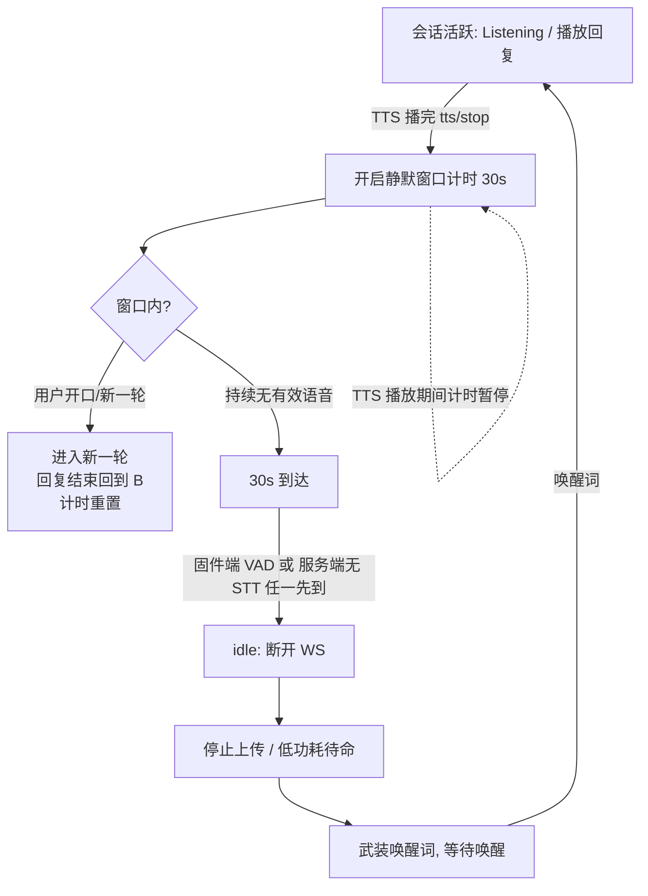
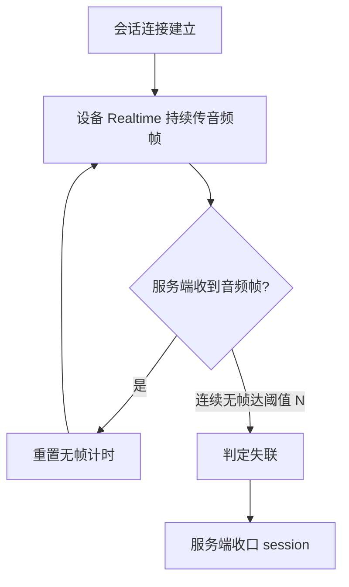

# 设备静默 idle 产品需求文档(固件 + 服务器)

## 1. 文档信息

| 版本号 | 创建日期 | 负责人 | 状态 |
|--------|----------|--------|------|
| V1.0 | 2026-09-06 | [待定] | 待评审 |

## 2. 修订历史

| 版本 | 修订内容 | 修订时间 | 修订人 |
|------|----------|----------|--------|
| V1.0 | 初稿创建(idle 触发/静默窗口/心跳/异常兜底) | 2026-09-06 | [待定] |
| V1.1 | idle#2 失联识别由"设备心跳"改为"服务端音频 liveness 超时"(Realtime 下连着必传音频帧,无帧即失联,免心跳包) | 2026-09-06 | [待定] |

## 3. 名词解释

| 术语 | 解释 |
|------|------|
| WS 连接 | 设备与服务端之间的 WebSocket 音频通道(本产品"会话"的载体);**idle 在本产品中等价于断开 WS** |
| idle | 本文档定义的产品状态:对话告一段落后设备回到"待命",断开 WS、停止上传、低功耗、重新武装唤醒词 |
| Realtime / AutoStop / ManualStop | 固件三种听音模式;Realtime 为本产品默认(设备 AEC 开启),连续实时对话 |
| 唤醒词 | 设备侧本地检测的唤醒口令(如 "Pigugu"),idle 后需唤醒词重建会话 |
| TTS / tts/stop | 助手语音回复 / 该轮回复播放结束的信号 |
| VAD | 语音活动检测;区分"有效人声"与静音/噪声 |
| STT 活动 | 服务端语音识别产出(interim/final),作为"用户确实在说话"的服务端信号 |
| 追问窗口 | TTS 播完后仍保持听音、允许无唤醒词续聊的时长(= 静默窗口 30s) |
| 音频 liveness | 服务端判定设备存活的信号:设备在 Realtime 下只要连着就持续上传音频帧;"无音频帧超时"即可识别异常断电/断网(无需心跳包) |
| commit-on-finalize | 既有机制:每轮 turn 在回复收尾即落库,不依赖断开,保证 idle/断电不丢最后一行 |

## 4. 产品概述

### 4.1 产品背景

#### 市场现状

消费级语音助手(Google Home、Alexa)对"答完要不要继续听"普遍采用**短追问窗口 + 回待命**:默认答完即停听,可选的"Continued Conversation / Follow-up"让设备在回复后再听约 8s,无跟进则回待命。新一代对话式 AI 助手(Gemini Live 等)则倾向长驻会话、靠 VAD/打断做 turn 切换,用更长的非活动超时收尾。

#### 问题与机会

Pigugu 是带人格、多轮、支持打断的**陪伴型语音助手**。固件默认跑 Realtime 会话(设备 AEC 开启),迁移到服务端 turn 判定后暴露一个问题:**回复播完设备回到 Listening 态、mic 持续上传,没有任何"自动回待命"机制**。用户安静下来,设备仍保持"听音 + 流式上传 + WS 长连"的空转活跃态:
- 持续占用功耗(电池)/带宽/云端 session;
- 长时间"监听中"也给用户不安的隐私观感;
- 设备无法自行回到"唤醒词待命",会话边界不清晰。

机会:把"对话结束"收敛成明确、可预期、省资源的 idle(= 断开 WS),同时保留足够宽的追问窗口以支撑陪伴式多轮体验。

#### 为什么是现在

- 服务端已切换到按 VAD/静音判 turn(commit-on-finalize 也已上线:每轮回复收尾即落库),**最后一行上报不再依赖断开**,idle 化不会丢数据——这是先决条件;
- 观测到线上 session 在用户长时间静默时仍不结束,资源空转确认存在;
- 趁语音会话重构期一并把 idle 语义定义清楚,避免固件/服务端各自悬置。

#### 我们的优势

- 全栈可控:固件与自研服务端同一团队,idle 两端可对称设计(固件 VAD 兜底 + 服务端无 STT 兜底);
- 参数可配:静默窗口、无帧超时做成配置,可按设备(电池/常供电)与场景调优,无需改固件重烧。

### 4.2 产品目标

| 目标 | 度量口径 |
|------|----------|
| 对话告一段落后设备自动回待命 | TTS 播完后用户持续静默,设备应在静默窗口(默认 30s)内断开 WS 回到待命 |
| 追问窗口内无缝续聊 | 静默窗口内开口 → 无唤醒词直接续轮,不误断 |
| 不误伤正在进行的对话 | 助手长回复/播放期间说话(打断)不触发 idle;误 idle 率 = 0 |
| 不丢对话数据 | idle / 断电 / 复位重启均不丢最后一行(依赖 commit-on-finalize) |
| 失联可感知 | 设备异常断电后,服务端在无帧超时(默认 ~30s)量级内收口 session(而非 120s+ 僵尸占用) |
| 可调优 | 静默窗口、无帧超时固件/服务端均可配 |

### 4.3 目标用户

- **主用户**:在家里与 Pigugu 进行多轮陪伴式对话的成员(常问天气/闲聊/多轮追问/打断纠偏),希望"聊起来连贯、停下来干净"。
- **次要使用方**:硬件电池供电或长期上电两种形态;希望设备安静时省电、少占用网络与云端。
- **非目标**:专业/呼叫中心式长会话工具(需要"挂了自动重呼/长时间思考"语义)——不在本设计范围。

### 4.4 用户痛点

| 痛点 | 证据/场景 |
|------|-----------|
| 答完还"亮着听",没有结束感 | 线上观测:用户静默 2.5 分钟,WS 与 mic 流仍持续(session 一直热) |
| 白白耗电/占网/占云端 | Realtime 下无自动 idle,设备在静默期持续上传与保活 |
| 想再说话时反而要担心"是不是该说唤醒词" | 会话边界不清:不知道现在算"还在聊"还是"已待命" |
| 隐私观感 | 长期"监听中"状态让用户不安 |

### 4.5 主要功能(两类 idle + 兜底)

"idle(回待命)"在本产品技术上等价于**断开 WS**。产品 idle 只有两类,外加一类兜底:

- **idle #1 — 静默超时(OR)**:固件端 VAD 连续 30s 无有效人声,**或**服务端连续 30s 无 STT 活动 —— 任一满足 → idle(断 WS)。两端独立计时、互为冗余。
- **idle #2 — 用户关电源**:设备断电,不发干净 close;服务端通过**无音频帧超时(失联检测)**识别并收口(音频 liveness 是实现 #2 与失联兜底的机制,不是独立的第三种 idle)。
- **兜底 — 用户复位 / 重启硬件**:设备重连出新 session;旧 session 由无帧超时收口;最后一行不丢。

共性支撑:

- **计时口径**:静默超时自 **TTS 播完**起算;TTS 播放期间暂停计时;窗口内用户开口 → 续轮并重置计时。
- **追问窗口**:默认 **30s**,窗口内续聊免唤醒词;超时回待命,再交互需重新唤醒词。
- **参数可配**:静默窗口、无帧超时,固件 + 服务端均可配。

### 4.6 竞品分析

| 竞品/方案 | 做法 | 对 idle 窗口的取值 | 启示 |
|-----------|------|------------------|------|
| Google Home "Continued Conversation" | 助手答完后**再听约 8s**,无跟进回待命;默认关 | ~8s | 计时从"回复播完"起算(与我们的口径一致);窗口较短 |
| Alexa "Follow-up Mode" | 完成后听"数秒",超时待命;默认关 | ~数秒 | 同上 |
| 语音 agent 平台(ElevenLabs/LiveKit/Telnyx) | **turn 级端点判定**用 0.5–8s 短超时+语义;**会话级非活动**另行收尾 | turn:0.5–8s | turn 端点(判"用户说完")与服务端我们已用 VAD/silence 覆盖,与 idle 是两层 |
| Gemini Live 等连续对话 | 长驻会话、VAD/打断切 turn、更长非活动超时 | 更长 | 面向"持续对话"但资源/常驻成本高,不适合低功耗硬件空转 |

**结论与差异**:
- 计时起点"TTS 播完"与消费级一致;
- 窗口取 **30s 默认**(宽于 ~8s),因为 Pigugu 是陪伴型多轮对话,"聊着聊着要说唤醒词"是体验痛点;为控制成本做成**可配**,电池设备可下调。
- 长回复/打断不误杀:两个计时器均在 TTS 播放期间暂停。

## 5. 功能需求

功能按两类 idle + 兜底组织:5.1 静默 idle(idle #1);5.2 电源 idle(idle #2)+ 复位/重启兜底(音频 liveness 无帧超时为 #2 与失联兜底的实现机制);5.3 非功能需求。

### 5.1 静默 idle(idle #1:固件端 30s VAD / 服务端 30s 无 STT,任一即断)

#### 功能概述

在一轮对话回复播完(TTS 结束)后开启静默窗口计时。窗口内若用户开口并形成新一轮,计时随新一轮回复结束重置;窗口内持续无有效语音,则**设备端或服务端任一先到 30s 即触发 idle**:设备断开 WS、停止上传、回低功耗待命并武装唤醒词;服务端相应收口 session。两端独立计时、互为冗余(固件 VAD 哑了服务端兜,服务端 STT 挂了固件兜)。

#### 用户场景

**场景 1:一问一答,问完离开**

- **用户**:家里用户
- **背景**:用户唤醒设备问"今天天气",助手答完
- **目标**:答完离开,不希望设备一直亮着监听
- **行为**: 1) 说唤醒词提问 2) 助手回复 3) 用户沉默 4) 30s 后设备自动回待命(断 WS、灯灭)
- **结果**:设备干净回到待命,省电省流
- **痛点(现状)**:答完设备一直热着监听、WS 不结束

**场景 2:连续多轮追问**

- **用户**:家里用户
- **背景**:用户正连续询问,"那明天呢?""湿度呢?"这类快追问
- **目标**:追问不被唤醒词打断
- **行为**: 1) 首问+回复 2) 20s 内追问(无唤醒词) 3) 助手续答,窗口随每次回复重置 4) 追问停止后 30s 回待命
- **结果**:对话连贯;停下来又能自动收尾
- **痛点(现状)**:要么一直热着,要么会话边界不清

**场景 3:助手长回复**

- **用户**:家里用户
- **背景**:助手播报较长内容(>30s),用户安静听
- **目标**:不因播放时间长被误断
- **行为**: 1) 用户提问 2) 助手播放长回复 3) 播放期间计时暂停 4) 播完才开始计 30s
- **结果**:不误 idle
- **痛点(现状)**:若按裸静音计时,长回复会误杀会话

#### 功能流程

#### 前置条件

- 设备已建 WS 会话、处于可对话状态;
- 上一轮回复已播放完毕(TTS 结束信号已到固件与服务端)。

#### 后置条件

- 触发 idle:WS 断开;设备低功耗 + 唤醒词武装;服务端 session 收口(不丢行,见异常);断开后需唤醒词重建会话。

#### 异常场景

| 异常情况 | 触发条件 | 处理方式 | 用户提示 |
|----------|----------|----------|----------|
| 助手长回复被误断 | 回复 > 窗口时长 | 计时在 TTS 播放期间暂停,播完才计 | 无(不误断) |
| 播放中用户开口 | 打断 | 走 barge-in 路径,不算 idle;按新一轮计 | 无 |
| 固件/服务端计时不同步 | 网络抖动/时钟差 | 两端独立计时,任一先到即断,天然兜底 | 无 |
| 服务端先断但固件未感知 | 服务端 close | 固件收到 close → 回待命 + 唤醒词武装 | 无 |
| 固件先断但服务端未感知 | 设备主动断 | 服务端断开/无帧检测收口 | 无 |
| 设备异常断电 | 无 close | 服务端无帧超时清 session(见 5.2) | 无 |
| 设备复位/重启 | 用户操作 | 自动重连新 session;旧 session 由无帧超时收口;最后一行不丢 | 无 |

### 5.2 电源 idle(idle #2)+ 复位/重启兜底(音频 liveness 超时为识别机制)

#### 功能概述

**idle #2(用户关电源)**:设备断电时不发干净 close,服务器无法靠设备通知感知。本产品设备为 Realtime 听音模式,**只要 WS 连着就持续上传音频帧**——音频帧本身就是存活信号;设备正常 idle 会主动断 WS(服务端经断开感知收 session),只有异常失联(断电/断网/半开连接)才会"WS 没关但音频停传"。服务端据此用**无音频帧超时**(默认 30s,原 120s 收紧)判定失联并收口,无需设备心跳包。区别于 idle #1(面向"用户安静但设备还连着"——静默≠无帧),idle#2 兜的是"设备物理失联但没发 close"。

**兜底(用户复位/重启)**:设备重启后重连出新 session,正常进入对话;旧 session 由无帧超时收口,最后一行不丢(依赖 commit-on-finalize)。

> 曾规划设备心跳 `{"type":"ping"}` 作失联探测,已废弃:判据"无音频帧"已覆盖断电/断网,心跳不改变判定、徒增协议与状态。

#### 用户场景

**场景:对话中设备断电**

- **用户**:家里用户
- **背景**:设备正在对话中/待听,用户直接关电源
- **目标**:服务器别把死连接当活 session 占用
- **行为**: 1) 对话中 2) 用户断电(无 close) 3) 服务端连续无音频帧达阈值 4) 服务端清掉该 session
- **结果**:僵尸 session 在 ~30s(阈值)内被收口
- **痛点(现状)**:只能等 120s 无帧超时,期间占用资源

#### 功能流程

#### 前置条件

- 设备已建 WS 会话且处于 Realtime 听音(音频帧持续上传)。

#### 后置条件

- 无帧超时收口后:session 结束;无新行产生;设备若还活着重连则开新 session。

#### 异常场景

| 异常情况 | 触发条件 | 处理方式 | 用户提示 |
|----------|----------|----------|----------|
| 对话音频帧持续 | 正常 | 音频帧即 liveness,无帧计时持续被重置,不会误收口 | 无 |
| 设备网络抖动 | 短暂断连 | 允许阈值内容忍;超阈值才收口;设备重连开新 session | 无 |
| 静默 30s 先到 | 用户安静但设备仍连着 | 走 5.1 idle 主动断,不等无帧超时(idle#1 计"无语音",idle#2 计"无音频帧",判据不同) | 无 |

### 5.3 非功能需求

#### 性能需求

- 静默窗口:默认 **30s**,固件/服务端可配(建议配置键固件 sdkconfig、服务端 env/config);判定误差 ±1s 内。
- 无帧超时(idle#2):默认 **30s**,服务端 env 可配;设备异常断电后服务端在该量级内收口 session(原 120s 收紧)。
- TTS 播放期间计时暂停须可靠(以播放结束信号为准),不得误判长回复。
- 以上计时不影响音频主路径实时性(不可在音频任务里做阻塞)。

#### 可观测性/日志

- 触发 idle 与无帧超时收口需有日志(idle 原因:固件 VAD / 服务端无 STT / 服务端失联),便于核对误判。

#### 兼容性

- 固件与服务端需同步发布对应版本;旧服务端/旧固件并存时按"旧行为"运行(不回归丢行)。
- 参数变更无需重烧固件即生效(服务端可配);固件参数变更需重烧(本版本做 sdkconfig 可配)。

## 6. 参考资料

- 行业参照:Google Home Continued Conversation(~8s)、Alexa Follow-up Mode(参见产品对话中竞品分析)
- 语音 agent 端点/会话超时:ELEVENLABS、LiveKit、Telnyx 文档(见竞品分析表)
- 内部依赖:commit-on-finalize 机制(voice.turns 每轮收尾即上报);服务端 turn 判定(VAD/silence)

---

# PRD Review清单

## 完整性检查
- [x] 产品背景清晰,说明了为什么做(现状空转、资源/功耗/隐私、为何现在)
- [ ] 目标用户有明确画像(有主用户/次要/非目标,负责人待补)
- [x] 用户痛点有案例/观测支撑(线上 session 不结束为证)
- [x] 竞品分析覆盖主要竞品(Google/Alexa/agent 平台/Gemini)
- [x] 功能需求可执行、可验收(5.1/5.2 + 验收场景)
- [x] 异常场景考虑全面(长回复/打断/断电/复位/失联)

## 质量检查
- [x] 无模糊表述
- [x] 有量化指标(30s、T、N、±1s)
- [x] 流程图清晰完整(Mermaid)
- [x] 前后一致

## 可读性检查
- [x] 结构清晰、层级分明
- [x] 表格对齐
- [x] 术语有解释

**待定项**:文档负责人;静默窗口与无帧超时的最终默认值是否需上会拍板。
